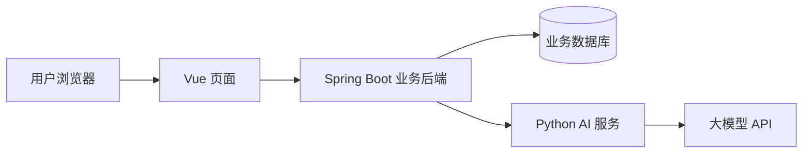

<h1 align="center">日迹 · DayTrace</h1>

<p align="center">
  <strong>每一天，都有迹可循。</strong><br />
  记录生活，借助 AI 整理文字，把计划安排到日历。
</p>

<p align="center">
  <a href="docs/requirements-boundary.md">需求边界</a> ·
  <a href="docs/architecture.md">系统架构</a> ·
  <a href="docs/README.md">开发文档</a>
</p>

## 项目介绍

DayTrace 是一个日记／笔记与日程管理 Web 应用，也是一个以自主实现和学习为主的毕业设计项目。它围绕一条完整流程展开：

**写下记录 → AI 辅助整理 → 提取候选日程 → 用户确认 → 加入日历。**

用户也可以直接创建、修改和删除日程。AI 提供建议，用户保留对文字与安排的最终决定权。

> 当前状态：已完成需求边界讨论、架构设计和仓库目录骨架。业务功能尚未实现，仓库暂不可直接启动。

## 首版规划

以下为计划实现的范围，不代表当前已交付功能。

| 模块 | 计划内容 |
| --- | --- |
| 账号 | 注册、登录、退出、修改密码；不同用户内容隔离 |
| 日记与笔记 | Markdown 编辑与预览、标签、关键词搜索、回收站；允许一天多篇日记 |
| AI 写作 | 根据零散要点整理成文、润色选中文本；预览后采用 |
| AI 日程提取 | 从当前记录识别安排，补齐时间等信息后逐项确认入表 |
| 日程管理 | 日历查看、手动增删改、定时／全天事项、冲突与疑似重复提示 |

首版暂不包含共享协作、独立 App、图片附件、重复日程、提醒、外部日历同步、独立待办和 AI 时间复盘。详细边界见 [需求文档](docs/requirements-boundary.md)。

## 系统结构



- **Vue**：记录编辑、日历与 AI 结果确认界面。
- **Spring Boot**：身份与权限、记录与日程规则、业务数据保存。
- **Python + LangChain**：整理文字、润色和提取候选日程，不直接访问业务数据库。

AI 只处理用户本次主动提交的内容，不自动读取历史日记。AI 不可用时，基础记录与日程功能应继续可用；这些约束将在实现时验证。

| 层次 | 已确定方向 | 当前建议，搭建时确认 |
| --- | --- | --- |
| 前端 | Vue | Vue 3、Vite、Vue Router、JavaScript |
| 业务后端 | Java、Spring Boot | Java 21、Maven、Spring Security、MyBatis |
| AI 服务 | Python、LangChain | Python 3.12、FastAPI、Pydantic |
| 数据存储 | 由 Java 统一管理业务数据 | MySQL 8.4、Flyway |

具体依赖版本和模型服务商尚未锁定。设计理由、接口草案与验证方案见 [系统架构设计](docs/architecture.md)。

## 仓库结构

```text
DayTrace/
├── frontend/                 # Vue 前端目录骨架
│   ├── public/
│   └── src/
│       ├── api/              # 业务 API 调用
│       ├── assets/           # 前端静态资源
│       ├── components/       # 通用组件
│       ├── router/           # 页面路由
│       └── views/            # 页面
├── backend/                  # Spring Boot 后端目录骨架
│   └── src/
│       ├── main/
│       │   ├── java/
│       │   └── resources/db/migration/
│       └── test/java/
├── ai-service/               # Python AI 服务目录骨架
│   ├── app/
│   │   ├── api/
│   │   ├── schemas/
│   │   ├── services/
│   │   ├── prompts/
│   │   └── providers/
│   └── tests/
├── deploy/                   # 后期部署配置
├── docs/                     # 需求、架构与决策记录
│   └── adr/
└── CONTEXT.md                # 领域术语
```

空目录使用 `.gitkeep` 纳入版本控制；添加实际文件后可移除对应占位文件。

## 开始阅读与开发

1. 阅读 [需求边界](docs/requirements-boundary.md)，了解首版做什么。
2. 阅读 [领域术语](CONTEXT.md) 与 [系统架构](docs/architecture.md)，理解各模块职责。
3. 按需进入 [前端](frontend/README.md)、[业务后端](backend/README.md)、[AI 服务](ai-service/README.md) 或 [部署](deploy/README.md) 说明。

当前没有 `package.json`、`pom.xml`、Python 依赖清单或应用入口，因此暂不提供启动命令。下一步是共同确认工程依赖与数据模型，再逐个模块实现。

## 开发路线

- [x] 明确需求边界与辅导方式
- [x] 完成架构初稿与仓库骨架
- [ ] 工程初始化与账号功能
- [ ] 日记／笔记、标签、搜索与回收站
- [ ] 手动日程与时间规则
- [ ] 使用固定样例打通 Java／Python AI 接口
- [ ] 接入模型，实现写作与日程提取
- [ ] 效果评估、权限验证、部署与答辩材料

预计于 **2027 年 4 月**完成，按每周约 10 小时逐步推进。主要代码由项目作者编写，AI 助手负责需求讨论、思路讲解、代码审查和排错辅导。

## 提交与配置

- 小步提交，记录本次修改及验证结果；业务实现与对应文档保持一致。
- 不提交真实日记、数据库备份、日志、密码或 API 密钥。
- 本地环境文件、依赖目录与构建产物由 `.gitignore` 排除；依赖锁文件应提交。
- 模型调用预算与部署环境在对应阶段确定。

## 许可证

当前尚未选择开源许可证，仓库不声明 MIT 或其他开源授权。
