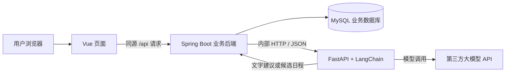
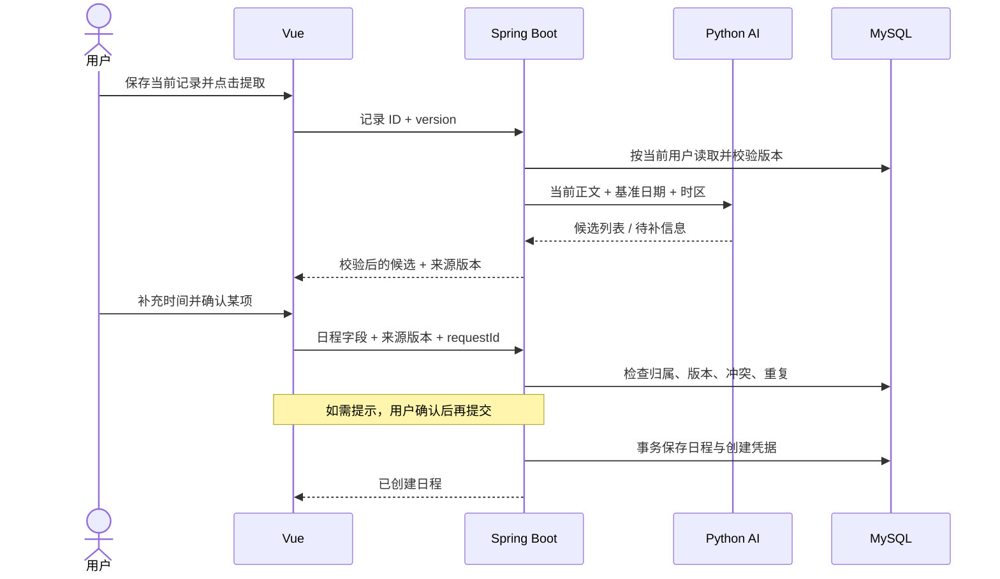

# DayTrace 系统架构设计

版本：v0.1。依据：已确认的 [需求边界](requirements-boundary.md) 与 [Python AI 服务决策](adr/0001-python-ai-service.md)。

本文是供学习和后续实现使用的设计，不包含业务代码。Vue、Spring Boot、独立 Python LangChain 服务已确认；MySQL、MyBatis、FastAPI、会话认证等为本轮建议，尚未搭建或验证依赖组合。后续可调整实现手段，但需保持已确认的产品边界。

## 1. 总体结构

采用一个按业务模块组织的 Spring Boot 应用，加一个职责有限的 Python AI 服务。所有业务模块使用同一个业务数据库；首版各服务单实例部署。



- 浏览器只访问 Java 业务 API。Python 不对浏览器开放，也不接收浏览器会话。
- Java 负责登录身份、资源归属、业务校验、日期规则、冲突提示、事务和业务数据保存。
- Python 接收本次任务必要的文字与日期上下文，返回结构化建议，不持有业务数据库账号。
- AI 失败不影响基础读写；任何 AI 结果都不能直接触发日程写入。
- 首版无需服务注册中心、消息队列、Redis、向量数据库或自主执行工具的 Agent。当前任务没有历史知识检索需求，不引入 RAG。

## 2. 建议技术组合

| 部分 | 建议 | 选择理由 |
| --- | --- | --- |
| 前端 | Vue 3 + Vite + Vue Router；先使用 JavaScript | 沿用已有基础，先理解组件、路由和 API；TypeScript 可后续讨论 |
| 页面组件 | 成熟组件库，日历组件在界面阶段选择 | 避免把大量时间花在基础表单与日历排版上 |
| Java | Java 21 + Spring Boot + Maven | 业务仍以熟悉的 Java 为主；具体 Boot 稳定版本在搭建时确定 |
| 权限 | Spring Security + 服务端 Session | 同源 Web 和单实例足够，退出与会话失效容易理解 |
| 持久层 | MyBatis | 显式编写 SQL，便于学习表关系、所有者过滤与事务 |
| 数据库 | MySQL 8.4，InnoDB、utf8mb4 | 使用关系约束与事务管理账号、记录和日程 |
| 数据库变更 | 按版本保存迁移脚本，建议 Flyway | 保证开发与部署的表结构可重复建立 |
| Python | Python 3.12 + FastAPI + Pydantic + LangChain | HTTP 接口、输入输出校验与模型编排职责清晰 |
| 测试 | Java 单元／接口测试、真实 MySQL 集成测试；Python pytest | 分别验证业务不变量、数据库行为与 AI 接口契约 |

不要在设计阶段随意拼接“最新”依赖。工程启动时按 Spring Boot 与 MyBatis Starter 官方兼容表选择组合，锁定 Maven 依赖、前端 lockfile 和 Python 依赖版本；FastAPI、Pydantic、LangChain 与具体模型适配包一起验证。

Vue 官方快速入门采用 Vite；FastAPI 提供基于 Pydantic 的数据校验。上述选择用于控制本项目学习范围，不表示其他组合不可行。[Vue 文档](https://vuejs.org/guide/quick-start)、[FastAPI 文档](https://fastapi.tiangolo.com/features/)

## 3. 代码组织与依赖

仓库已建立以下目录骨架；后端已导入 Java 21、Spring Boot 4.1.1 与 Spring Web MVC 初始工程，并完成 hello 的 GET／POST、JSON 与参数校验学习。独立页面原型位于 docs/prototype；正式 Vue 与 AI 服务尚未初始化依赖或入口，其他技术组合仍为设计建议：

```text
DayTrace/
  frontend/                  Vue 页面
  backend/                   Spring Boot 应用
  ai-service/                Python 服务
  docs/                      需求、架构、接口、测试证据
    adr/                     重要架构取舍
  deploy/                    后期部署配置
```

Java 按业务分包，每个模块内部再区分 Controller、Service、Mapper、DTO：

| 模块 | 负责 | 不负责 |
| --- | --- | --- |
| auth | 注册、登录、退出、密码修改、当前用户 | 读取用户日记内容 |
| journal | 日记／笔记、标签、搜索、回收站 | 模型调用、修改日程 |
| calendar | 日程读写、时间校验、冲突和重复提示、创建幂等 | 解释自然语言 |
| ai | 读取获授权的当前输入、调用 Python、校验返回结果 | 直接保存日程、替用户采用写作结果 |
| common | 错误结构、时间来源、少量公共配置 | 堆放各模块业务逻辑 |

基本调用方向：Controller → Service → Mapper。Service 承担事务与权限校验；Controller 不直接操作数据库。`ai` 通过 `journal` 提供的服务读取当前用户的记录，确认候选日程使用普通 `calendar` 写入流程。

Python 分成 `api`（路由）、`schemas`（输入输出）、`services`（三种任务）、`prompts`（提示词版本）、`providers`（模型适配）、`tests`。首版一个服务即可。

## 4. 页面与数据流

建议页面：登录／注册、记录列表、记录编辑、日历、回收站、账号设置。

- 记录编辑页提供类型、日期、标题、Markdown、标签，以及 AI 要点整理、选中润色、提取日程入口。
- AI 写作先展示原文与建议；用户采用后更新编辑草稿，点击保存时使用普通记录接口。
- 候选日程以可编辑表单展示，标明原文依据、具体日期及待补字段；逐项确认。
- 日历提供月／周／日视图和创建／编辑弹窗。手机保证基本列表、阅读和表单操作，不要求与电脑布局一致。
- 页面草稿仅保存在当前页面内存中，离开未保存页面时提示；不默认把私人正文长期放入浏览器存储。自动保存与版本历史不纳入首版。

## 5. 概念数据模型

以下为核心字段设计，详细长度、DDL 与索引执行计划在数据库设计阶段完成。统一使用 `record` 作为领域概念，数据库命名使用 `journal_record` 避免歧义。

| 表 | 核心字段 | 关键规则 |
| --- | --- | --- |
| app_user | id、username、password_hash、auth_version、created_at | 用户名规范化后唯一；密码只保存安全哈希 |
| journal_record | id、user_id、type、title、content、record_date、version、deleted_at、created_at、updated_at | type 为 DIARY／NOTE；日记日期必填且不唯一；笔记不依赖日记日期 |
| tag | id、user_id、name | 同一用户内标签名唯一 |
| record_tag | record_id、tag_id | 组合唯一；双方必须属于当前用户 |
| calendar_event | id、user_id、title、description、location、time_kind、start_at、end_at、start_date、end_date_exclusive、source_record_id、version、created_at、updated_at | 时间字段按类型互斥；来源可空；用户归属不可由前端指定 |
| event_creation_receipt | user_id、request_id、payload_hash、event_id、created_at | user_id 与 request_id 联合唯一，防止同次确认重复创建 |

用户与记录、标签、日程均为一对多；记录与标签为多对多；一个来源记录可以生成多项日程。

### 时间与删除

- 定时日程使用 `[start_at, end_at)`，结束时间必须晚于开始时间；相邻的 10:00—11:00 和 11:00—12:00 不冲突。
- 定时日程 API 使用带时区偏移的 ISO 时间；Java 转为 UTC 存储，展示和自然语言日期计算统一用 Asia/Shanghai。
- 全天日程使用日期范围 `[start_date, end_date_exclusive)`，单日事项的结束日期为下一天；不与定时日程触发冲突提示。
- 全天事项之间首版也不提示时间冲突，但相同标题及日期仍可提示疑似重复。
- 记录进入回收站后，默认列表、搜索和 AI 提取不再访问它；来源日程仍保留。恢复记录不修改日程。
- 永久删除记录时，在事务中清理记录标签关联，并将日程来源外键置空；不保留来源正文副本。日程本身的标题与描述作为独立内容保留。
- 日程删除后保留最小创建凭据，event_id 置空；重放旧 request_id 返回“原日程已删除”，不重新创建。凭据不保存正文。

### 查询、归属与并发

- 查询和更新始终同时约束资源 ID 与当前用户 ID；列表、搜索、标签、回收站、来源链接也采用同样规则。
- 初期搜索用带用户过滤、参数绑定和分页的标题／正文关键词查询；不引入全文搜索服务。
- 建议索引：记录 `(user_id, deleted_at, record_date, id)`；日程 `(user_id, start_at)`、`(user_id, start_date)`、`(user_id, source_record_id)`；标签 `(user_id, name)`。
- `version` 用于乐观锁：更新必须匹配旧版本，不匹配返回 409，提示刷新后比较，不能默默覆盖另一个窗口的修改。
- 外键保证关系存在，Service 保证所属用户一致。任何前端传来的 userId 不参与授权。

## 6. 核心流程

### 6.1 AI 写作

浏览器发送选中文本或用户输入的要点 → Java 验证身份、长度和限流 → Python 执行指定任务 → 返回建议文本 → 用户预览并采用到草稿 → 普通记录保存接口。

AI 返回期间若编辑内容已变更，不自动套用旧结果，要求用户重新比较或重试。初版润色仅发送选中文字，不附带整篇历史上下文。

### 6.2 从记录生成日程



建议首版先保存记录再提取，避免已保存正文与提取文本不一致。候选仅保存在当前页面，不创建候选表；刷新后可以重新提取。

1. 日记使用 `record_date` 作为“明天”的基准；笔记使用发起请求时的北京时间日期。请求与结果携带该基准，不由模型猜测今天。
2. 缺少结束时间、只有“下午”等情况返回待补字段，不能擅自将“明天”视为全天日程。
3. “可能”“待定”等标记为不确定；用户可编辑并明确确认，不静默丢弃，也不自动落表。
4. 确认时 Java 再次检查来源归属与版本；原文发生变化或进入回收站则要求刷新，不接受过期候选直接入表。
5. 定时冲突条件为 `existing.start < new.end && existing.end > new.start`，仅查询当前用户；修改时排除自身。
6. 初版疑似重复规则为“当前用户下，规范化标题相同且时间范围相同”，无需向量相似度。来源相同可作为解释依据，不要求来源必须相同。
7. 写入遇到冲突或疑似重复先返回提示；用户明确接受后允许保存。这是辅助提示，不保证并发创建时绝无重叠。
8. 每个候选独立确认并生成一个 requestId；同次网络重试复用它。事务内以唯一约束竞争创建凭据，成功后写日程，失败整体回滚；同 ID 同内容重放返回原结果，同 ID 不同内容返回 409。
9. 幂等重放先于来源版本和冲突检查，避免已经成功的创建因后续变化被误判为失败；重放仍必须验证当前用户。新的提取或新的创建操作使用新 ID。

创建凭据在确认提示完成、真正写入时才产生。payload_hash 基于规范化后的业务字段、来源 ID 与来源版本计算，不包含“已知晓提示”等控制字段；前端修改候选内容后为新的创建意图分配新 ID。创建凭据与 AI 调用的链路 requestId 是不同用途，接口设计时分别命名。

### 6.3 手动管理日程

手动创建与 AI 确认共用日程创建服务、时间校验、冲突提示和幂等逻辑，区别只在来源是否为空。日程修改不回写日记；修改采用 version 防覆盖。

## 7. 接口边界草案

下列路径表达职责，详细字段、JSON 示例、分页和错误码见 [API 接口设计稿](api接口文档.md)。接口均尚未实现。业务接口统一 `/api/v1`，用户身份从会话取得。

| 接口组 | 代表性接口 |
| --- | --- |
| 账号 | `POST /auth/register`、`POST /auth/login`、`POST /auth/logout`、`GET /auth/me`、`PUT /auth/password`、`GET /auth/csrf` |
| 记录 | `GET/POST /records`、`GET/PUT/DELETE /records/{id}` |
| 回收站 | `GET /records?deleted=true`、`POST /records/{id}/restore`、`DELETE /records/{id}/permanent` |
| 标签 | `GET/POST /tags`、`PUT/DELETE /tags/{id}` |
| 日程 | `GET /events?from=...&to=...`、`POST /events`、`PUT/DELETE /events/{id}` |
| AI | `POST /ai/compose`、`POST /ai/polish`、`POST /records/{id}/extract-events` |

列表必须分页，日历按范围查询并限制最大跨度。统一错误体包含 `code`、`message`、`requestId` 和可选字段错误；401 未登录，404 不存在或不属于用户，409 版本／幂等冲突，422 业务输入不完整，429 限流，502／504 AI 上游错误／超时。

候选结构至少包含 `title`、`timeKind`、定时或全天日期字段、`location`、`evidenceText`、`missingFields`、`uncertaintyReasons`。缺失值明确为 null；不要用模型自报的 confidence 数字代表准确率。

Python 内部接口建议为 `/internal/v1/compose`、`/internal/v1/polish`、`/internal/v1/extract-events`。请求携带 requestId、任务输入、必要日期上下文和契约版本；不包含会话 Cookie、密码或用户全部记录。

## 8. AI 实现边界

首版采用固定处理步骤：输入检查 → 任务提示词 → 模型调用 → 输出解析与校验 → 返回结果。LangChain 用于统一模型调用、提示词和结构化输出，不赋予模型数据库、文件或网络执行工具。

LangChain 模型接口支持结构化输出；具体模型支持方式需在选定服务商后实测。FastAPI／Pydantic 校验 JSON 结构，Java 再校验时间与业务规则，两者都不能保证模型正确理解原文。[LangChain 模型文档](https://docs.langchain.com/oss/python/langchain/models)

- 提示词将用户正文作为待处理数据，要求给出原文依据，禁止补造人物、地点和已发生的事实；效果用样例评估，不以提示词代替校验。
- “没有日程”是成功返回空列表；模型拒绝、格式错误和上游超时分别返回明确错误。
- 关闭 SDK 和框架的隐式自动重试，格式错误也不自动发起修复调用；用户手动重试可能产生新的费用。
- 建议模型调用预算超时 30 秒、Java 等待 35 秒、浏览器等待 40 秒，部署代理略大于浏览器超时；数值经模型测试调整。浏览器断开不保证上游已经停止计费。
- 模型耗时操作不占用数据库事务。Java 对 AI 请求设置独立并发上限和每用户限制，避免拖垮基础接口。
- 正文长度、输出长度和并发上限配置化；开发先用假模型样例验证接口。实际 API 预算和模型未确定前，不开展付费效果测试。
- 日志只记 requestId、耗时、结果类别、模型／提示词版本和可用的 token 用量，不记私人正文、完整提示词、密码、Cookie 和密钥；不默认启用外部内容追踪。

## 9. 身份与内容安全

- 建议用 Spring Security 的服务端 Session；生产 Cookie 设置 HttpOnly、Secure、SameSite，前端不存储登录令牌。单实例重启后重新登录属于首版可接受限制。
- 保留 CSRF 防护；Vue 按约定取得 CSRF token，写请求携带 token，登录／退出后按框架规则刷新。开发代理与生产反向代理让浏览器使用同源 API。[Spring Security CSRF 文档](https://docs.spring.io/spring-security/reference/servlet/exploits/csrf.html)
- 密码使用 Spring Security PasswordEncoder 的安全方案，例如 BCrypt。修改密码校验旧密码，提升 auth_version，使该用户旧会话下次请求失效并重新登录。
- Markdown 预览禁用原始 HTML，输出仍进行清理；链接限制协议。模型返回内容使用同一渲染规则。
- Java 与 Python 用内部服务凭据通信；Python 只监听本机或私有容器网络。生产密钥从环境／部署配置读取，不提交仓库。
- 登录和 AI 请求都需适当限流。首版单实例限流不依赖 Redis，不承诺跨实例共享计数。
- 数据隔离是业务访问控制，不等同于端到端加密；拥有服务器或数据库管理权限的人仍有能力接触数据。

## 10. 开发与部署

开发时分别启动 Vue、Java、Python 和 MySQL；Vue 通过 Vite 代理调用 Java，Java 调用本机 Python。先跑通普通业务，再启动假模型 AI，最后接真实模型。

部署时建议一台 Linux 服务器：反向代理托管 Vue 静态产物并将 `/api` 转发到 Java，Java／Python／MySQL 在私有网络内运行。公网只开放站点入口，配置 HTTPS。Docker Compose 可在部署阶段引入，不作为学习第一个模块的前提。

基础健康检查不依赖真实模型调用；数据库备份和恢复至少演练一次。保存配置示例但不保存密钥；数据库迁移与应用版本一起记录。当前未选择服务器，也未执行部署。

## 11. 验证与毕设证据

| 层次 | 必须回答的问题 |
| --- | --- |
| 业务测试 | 日期基准、半开区间、全天处理、来源删除、版本冲突是否符合规则？ |
| 权限测试 | 用户 B 能否通过改 ID 读取／修改 A 的记录、日程、标签、回收站或触发 AI 提取？ |
| 数据库测试 | 事务回滚、唯一约束、并发重复确认和删除后重放是否正确？使用真实 MySQL 验证 |
| 服务契约测试 | Java／Python 对 null、日期、空结果、不完整结果和错误码的理解是否一致？ |
| 端到端测试 | 写记录 → 提取 → 补充 → 确认 → 日历可见；断网或 AI 超时后原文与基础功能是否正常？ |
| AI 效果评估 | 明确安排、相对日期、模糊描述、否定／过去事件和无日程文本能否正确区分？ |

建议建立约 50 条人工标注样例，包含多事件和边界情况；分成调试集与保留评估集，固定模型与提示词版本后报告事件识别精确率／召回率、明确时间字段准确率、应追问但未追问的次数、有效输出比例、耗时与用量。具体匹配方法和验收阈值在评估设计时约定；不能预先声称准确率达标。

样例使用自编或脱敏文本，报告成功与失败案例。先建立规则／固定返回的基线，证明用户确认与校验逻辑有效，再讨论 AI 效果。

## 12. 适合每周 10 小时的实施顺序

1. 工程与账号：学会请求经过 Controller、Service、Mapper 到数据库的完整路径。
2. 记录：先完成单篇记录增删改查和归属校验，再加入标签、搜索、回收站与 Markdown。
3. 日程：先手动创建与查询，再实现时间规则、冲突提示、并发版本和重复请求处理。
4. AI 契约：先用固定样例让 Java／Python／Vue 全链路跑通，不付费调用模型。
5. 真实 AI：完成写作预览与结构化日程提取，用标注样例观察错误并改进。
6. 收尾：权限与异常验证、部署恢复演练、效果报告、论文和答辩材料。

每次只推进一个可验证的小任务：共同明确目标与接口，用户实现，助手审查并讲解问题，用户修改验证。具体课表与详细数据库设计是后续工作，本轮不创建代码骨架。

## 13. 尚待落实

- 用户对本轮新增技术建议的偏好，及现有 Java／Node／Python／数据库环境；搭建时核实。
- 依赖兼容组合、UI 组件与日历组件；搭建或对应模块开始前确定。
- 模型服务商、费用上限、服务器配置；付费调用与部署前确定。
- 学校正式要求、最终截止日期、详细接口字段与测试阈值。

## 14. 官方参考

- [Spring Boot 系统要求](https://docs.spring.io/spring-boot/system-requirements.html)
- [MyBatis Spring Boot Starter 兼容表](https://mybatis.org/spring-boot-starter/mybatis-spring-boot-autoconfigure/)
- [MySQL 8.4 文档](https://dev.mysql.com/doc/refman/8.4/en/)

以上资料用于核实技术能力与兼容边界，文中的模块拆分、数据表、超时值和开发顺序均为针对 DayTrace 的设计建议。
